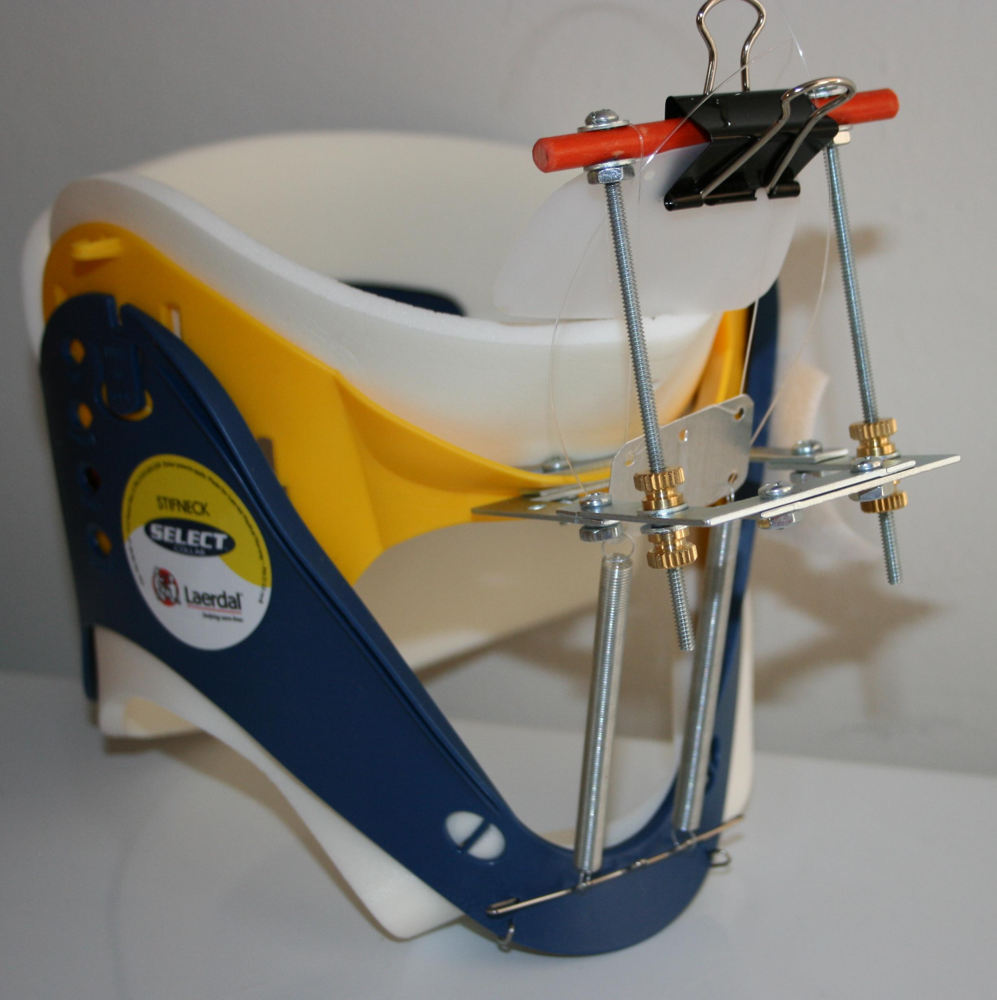
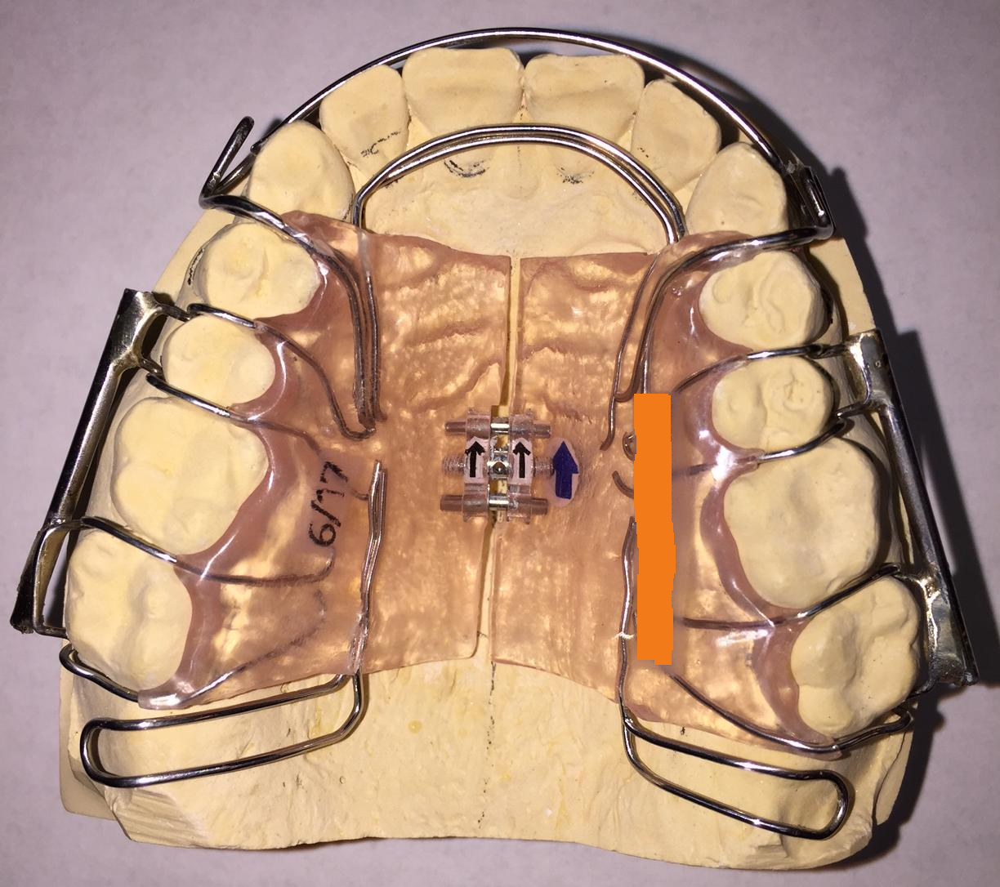

**Contents**

* TOC
{:toc}

## sleep or die

why every creature on this planet sleeps

and 95% of modern "westernized" people have some sleep apnea

deep sleep is about the only time when the body can truly regenerate

most people are conditioned to think that sleep apnea is "just another disease"

yet [most chronic diseases](https://www.cdc.gov/nchs/fastats/leading-causes-of-death.htm) 
and even death are due to lack of regeneration in sleep

official medicine considers adult progressive loss of sleep as ["normal aging"][sleep-time]

[][sleep-time]

uncorrected sleep disorder is "the real disease" behind most "incurable" chronic conditions

## what is sleep apnea

sleep apnea [manifestation mechanics][apnea-video]
 
[][apnea-video]

## why we have sleep apnea

sleep apnea is some 7000 years old, due to changes in:
* diet (introduction of grains, etc)
* habitat (lack of sun / vitamin d3, etc)

and now is additionally compounded by:
* cessation of [breast feeding][breast-feeding]
* obese and hypodynamic [life style][obesity-stats]

which resulted in:
* reduced skull size (brain volume is down 15%)
* reduced maxila and mandible size (jaw cross sizes are down 20%)

which manifests itself as:
* [deviated septum][deviated-ceptum]
* narrow [nose airway][nasal-congestion]
* insufficient space for tongue
* insufficient space for "wisdom" teeth
* multiple cranio-facial problems
* reduced neck / throat air pipe diameter  

compare lower jaw (mandible) of archeo vs mordern human:
<table cellpadding="10">
<tr><th>archeo</th><th>mordern</th></tr>
<tr>
<td>
all 32 teeth are present, including wisdom teeth (all 8 per side); 
there is even plenty of space to add few more teeth;
molars face straight up;
open wide arch; absolute dimensions are bigger;
</td>
<td>
not enough space even for the required 32 teeth (only 7 per side);
wisdom teeth are missing; 
molars must rotate inwargs;
narrow pointed arch; absolute dimensions are smaller; 
</td>
</tr>
<tr>
<td></td>
<td></td>
</tr>
</table>

## self diagnosis

for a d.i.y. sleep study done every night you can get the following:
* [night vision ifrared camera][amazon-infra-camera] installed above your bed
* [recording pulse oximeter][amazon-pulse-oximeter] mounted on your hand and finger

<table cellpadding="10">
<tr><th>infrared camera</th><th>pulse oximeter</th></tr>
<tr>
<td></td>
<td></td>
</tr>
<tr>
<td></td>
<td></td>
</tr>
</table>

what you might see on the camera recording:
* there is no r.e.m. sleep
* you sleep on the back, not on a side
* your jaw drops down and mouth stays open
* your breath pattern switches to fast and shallow
* you periodically start to suffocate and stop to breathe
* you wake up with elevated heart rate and a memory of a nightmare 

what you might see on the oximeter recording:
* oxygen level periodically drops during the night
* heart pulse rate periodically jumps up during sleep

if you correlate camera shots and oximeter time line
you might observe how suffocation events coincide with
the oxygen level drops and heart rate increases

## official diagnosis

beware: sleep apnea [is big business][sleep-business]

### sleep study

there is a plethora of [sleep study centers][sleep-center] 

their mission is to sell you a [sleep study][sleep-study]
and then a [c.p.a.p. machine][sleep-machine] 

you can do a do a study (for fun), but should really skip the machine:
* life expectancy of a c.p.a.p. user is 7 years
* c.p.a.p. gear will continue to contract you maxilla
* it will re-program your breath patterns into machine-dependence

### x-ray cephalometry

radiation is bad for you, regardless of the dose

nonetheless, some doctors might refuse an appliance 
unless you take a [c.b.c.t. scan][cbct-scan]

[x-ray cephalometry][cephalometry] of your skull might show the following (click on image for large scale):

<table cellpadding="10">
<tr>
<th width="30%">3d volume vertical cross section</th>
<th width="30%">upper horizontal cross section</th>
<th width="30%">lower horizontal cross section</th>
</tr>
<tr>
<td></td>
<td></td>
<td></td>
</tr>
<tr>
<td>"white" color code is "good" airflow cross section area  </td>
<td>upper airway must be round shape; this one is still "normal" </td>
<td></td>
</tr>
<tr>
<td>"red" color code is "real bad" airflow cross section area  </td>
<td></td>
<td>lower airway must be oval shape; this one is very "abnormal" narrow slit </td>
</tr>
<tr>
<td></td>
<td colspan="2">
"normal" shape of the back of the tongue should be "an even curve" of relaxation;
 
 
in this image, "multiple folds" on the back of the tongue mean
that the brain is trying really hard to keep the airway open
and keeping tongue contracted at all times
 
 
tongue stress will result in chronic throat inflamation
</td>
</tr>
</table>

## solutions vs workarounds

real solution needs global change on this planet

meanwhile you can still help children and adults with some workarounds

### orthodontics vs orthotropics

modern [orthodontics][orthodontics] is essentially a criminal enterprise

they will mangle your face in the name of vanity 
with no regard to [how it affects your breathing][right-to-grow]
even if you die of sleep apnea induced heart attack 20 years after
they made you look pretty by removing teeth and collapsing maxilla 

one proper alternative to orthodontics is [orthotropics][orthotropics]
inspired by [John Mew](http://johnmeworthotropics.co.uk/) and others

## solutions for children

educate yourself
* [right to grow][right-to-grow]

find a doctor with integrity
* [orthotropics in the u.s.](http://newsite.orthotropics-na.org/find-a-member/)

## workarounds for adults

use these workarounds while you wait for your appliance

you might need to try all of them to see which ones work best 

### increase nasal air flow

[][ebay-neti-pot]
use [neti pot][ebay-neti-pot]
* clear nasal air passage 
* apply 1 hour before sleep
* use warm neti pot solution at 37°C
* recipe: 4g of sea salt + 1L of boiling water 

[][amazon-essential-oil]
use [essential oil][amazon-essential-oil]
* use 30 minutes after neti pot
* [apply deep inside][essential-oil-video] nostrils with [cotton swab][cotton-swab]
* recipe: 50% olive oil + 50% essential oil mix by volume
* oil mix: equal volume of:
[thyme](https://en.wikipedia.org/wiki/Thyme),
[eucalyptus](https://en.wikipedia.org/wiki/Eucalyptus),
[peppermint](https://en.wikipedia.org/wiki/Peppermint),
[lavender](https://en.wikipedia.org/wiki/Lavandula)

[][amazon-nasal-dilator]
use [nasal dilator][amazon-nasal-dilator]
* install before sleep
* store in [small jelly jar][walmart-jelly-jars]
* use 0.3% [hydrogen peroxide][walmart-hydrogen-peroxide] for storage
* wash with warm water [before installation][dilator-video]

### open tongue space

[][amazon-mouth-guard]

use d.i.y. [mouth guard](https://www.youtube.com/watch?v=iPXnRTjIZhE)
or [anti snoring device][amazon-mouth-guard]
* moves mandible forward
* moves the tongue after mandible
* you need to [tape you mouth](https://www.youtube.com/watch?v=_t8ELYDW0ts) when using this
* beware: long term use advances [maxilla collapse](https://www.youtube.com/watch?v=oG2khF7AX94) 

### keep mouth closed

[][walgreens-paper]

listen to Mark Burhenne about [mouth taping](https://www.youtube.com/watch?v=z3lCxI75owQ)

use [paper tape][walgreens-paper]
to [seal your mouth](https://www.youtube.com/watch?v=_t8ELYDW0ts)
* prevent mouth drying up
* prevent lower jaw dropping
* prevent tongue closing the throat

### sleep on your side

[][walmart-backpack]
use tall or [narrow backpack][walmart-backpack]
* prevents air way collapse
* does not let sleep on the back
* helps to keep proper [sleep position][sleep-position]
* make it tall and fill backpack with 1-2 towels

### chew heavy gum daily

[][amazon-mastic-gum]

listen to "crazy" Mike Mew
[part-1](https://www.youtube.com/watch?v=74WnUB9Y63w)
[part-2](https://www.youtube.com/watch?v=5aFcL0Pra64)
[part-3](https://www.youtube.com/watch?v=IrdulzyOZCo)

toughest gum found so far: [greek][amazon-mastic-gum] [mastic gum][mastic-gum] 
* improve teeth blood circulation
* increase cranio facial bone growth
* rebuild tongue, mouth, throat muscles / posture
* start from 20+ minutes a day, build up to 2+ hours a day 

### learn to swallow properly

[][swallowing]

listen to "professor" Mike Mew
[part-1](https://www.youtube.com/watch?v=gcI8CvoFxfQ)
[part-2](https://www.youtube.com/watch?v=xxx)
* 85% of people swallow like babies
* rebuild tongue, throat muscles / posture

### keep the tongue at the roof

[][amazon-nose-breathe]

listen to "peaceful" Mike Mew
[part-1](https://www.youtube.com/watch?v=Y6h3-wsqLNA)
[part-2](https://www.youtube.com/watch?v=d2GV5PpssX4)
[part-3](https://www.youtube.com/watch?v=3yl-QliS2jk)
[part-4](https://www.youtube.com/watch?v=OxAoaoU1MSw)

use [nose breathe trainer][amazon-nose-breathe]
* discover proper [tongue position][nose-breathe-video]

### have fun with didgeridoo

[][didjeridoo-girl]

[proven method][didjeridoo-most] to help with sleep apnea
* build your own [from pvc pipe][didjeridoo-pipe]
* rebuild lung, throat, [diaphragm operation][didjeridoo-girl]
* rebuild tongue, mouth, throat muscles / posture

### sleep apnea exercises 

[][youtube-exercise]

use [sleep apnea exercises][youtube-exercise]
* alternate with didjeridoo
* trains via different exercise patterns
* rebuild tongue, mouth, throat muscles / posture

### sleep with face down 

[][ikea-pillow]

use [3-4 ikea memory pillows][ikea-pillow]
* sleep with mouth taped to prevent drying out
* sleep with face down to let gravity pull tongue down
* make a contraption similar to [pregnancy massage pillow](img/pillow-pregnant.jpg)
* use 3 pressure areas: forehead, collar bones, pelvis joints
* this ensures open space for lower face as well as for belly breathing

## reshaping appliance 

watch similar appliance [time lapse video][youtube-homeblock]

listen to "inspired" Mike Mew [growing your face](https://www.youtube.com/watch?v=TY3bIMRKil8)

learn details in [case study](doc/Expansion-Facemask-Treatment-of-an-Adult.pdf)
with similar appliance

you will need a [doctor][john-kelly] to help you with this project

use of [orthotropics][youtube-orthotropics] appliance
is an attempt to restore facial bones to their proper size

appliance provides expansion of upper jaw / [maxilla][maxilla],
lower jaw / [mandible][mandible] and pull of maxilla fowrard and upward

appliance components:
* upper / lower expanders
* face pull mask
* face bows
* head cap

### pull mask

[][ebay-stifneck]

listen to "demostrating" Mike Mew 
[part-1](https://www.youtube.com/watch?v=GE1EWUMbQ8U)
[part-2](https://www.youtube.com/watch?v=Cs-ROD3fLIs)
[part-3](https://www.youtube.com/watch?v=uyM4YPb-m7Q)

click for [large scale](img/stifneck-collar.jpg)

uses [cervical collar][cervical-collar] built from [laerdal stifneck][ebay-stifneck]
* creates forward/upward pull of the maxilla
* avoids typical backward push on the mandible
* allows for the "chewing exercise" with the appliance

### face bows

[][ebay-face-bow]

uses two [face bows][ebay-face-bow]
* attached through tubes to upper and lower appliances
* attached to the head cap to provide upward maxilla pull
* allows to lock mandible in "push forward position" during sleep

### upper appliance

click for [large scale](img/appliance-upper.png)

design notes:
* provides maxilla expansion
* uses face bow attahcment tubes
* provides maxilla forward/upward pull

### lower appliance

click for [large scale](img/appliance-lower.png)

design notes:
* provides mandible expansion
* uses face bow attahcment tubes
* allows to lock mandible in "push forward position" during sleep

## restorative materials 

use of the appliance requires active [bone remodeling][bone-remodeling],
which depends on proper function of body energy production,
hormones, digestion

since you discovered your sleep apnea condition rather late in life,
there is a very high chance that you experience multiple functional problems

functional deviations common in sleep apnea:
* high general inflamation / estrogen
* low progesterone / testosterone
* suppresed thyroid system
* damaged intestine

listen to Ray Peat [ideas on regeneration](https://www.youtube.com/results?search_query=ray+peat+regeneration)

required diet and supplements, based on thinking of [Ray Peat](http://raypeat.com)

### diet

Ray Peat [inspired diet](https://www.youtube.com/results?search_query=ray+peat+inspired+diet):
* [grass fed milk][barrington-farms]
* [grass fed liver][north-start-meat]
* [grass fed butter][barrington-farms]
* [free range eggs][barrington-farms]
* orange juice
* sweet fruits
* organic coffee
* grated carrot
* bamboo shoots
* beef gelatin
* coconut oil
* olive oil
* mushroom
* potato

### supplements

Ray Peat [inspired supplements](https://www.youtube.com/results?search_query=ray+peat+inspired+supplements):
* aspirin
* vitamin a
* vitamin b
* vitamin c
* vitamin d
* vitamin e
* vitamin k
* magnesium
* potassium
* [sea mollusc][sea-mollusc]
* pregnenolone
* progesterone
* testosterone
* d.h.e.a.
* cynoplus
* red light
* [milk enzymes][lactase]
* [fiber enzymes][beano]

[sleep-time]: http://www.habitot.org/hab/newsletter/sleep/sleep_over_the_lifespan_nrem_rem_ratio.html
[apnea-video]: https://www.youtube.com/watch?v=cxEWHV67JIU
[sleep-study]: https://en.wikipedia.org/wiki/Sleep_study
[sleep-machine]: https://en.wikipedia.org/wiki/Continuous_positive_airway_pressure
[sleep-business]: http://www.businesswire.com/news/home/20170505005558/en/79.85-Billion-Sleep-Aids-Market-Product-Sleep
[sleep-center]: https://www.sleepmedcenter.com/
[cbct-scan]: https://en.wikipedia.org/wiki/Cone_beam_computed_tomography
[cephalometry]: https://en.wikipedia.org/wiki/Cephalometry
[deviated-ceptum]: https://en.wikipedia.org/wiki/Nasal_septum_deviation
[nasal-congestion]: https://en.wikipedia.org/wiki/Nasal_congestion
[orthodontics]: https://en.wikipedia.org/wiki/Orthodontics
[orthotropics]: https://orthotropics.com/
[right-to-grow]: http://www.righttogrow.org/
[breast-feeding]: http://www.babymilkaction.org/archives/8412
[obesity-stats]: http://www.obesity.org/obesity/resources/facts-about-obesity/statistics
[dilator-video]: https://www.youtube.com/watch?v=XVfP4NMaX5U
[cotton-swab]: https://en.wikipedia.org/wiki/Cotton_swab
[essential-oil-video]: https://youtu.be/MDZGk6IThfY?t=1103
[mastic-gum]: https://en.wikipedia.org/wiki/Mastic_(plant_resin)
[sleep-position]: https://youtu.be/or03pT-D8cQ?t=510
[swallowing]: https://en.wikipedia.org/wiki/Swallowing
[didjeridoo-most]: https://didgeproject.com/sleep-apnea/the-5-most-effective-practices-to-treat-sleep-apnea-with-the-didgeridoo/
[didjeridoo-girl]: https://youtu.be/_ljVDCdNZmE?t=60
[didjeridoo-pipe]: https://www.youtube.com/watch?v=c_ZTSsixP94
[sea-mollusc]: https://en.wikipedia.org/wiki/List_of_edible_molluscs
[nose-breathe-video]: https://vimeo.com/70580334
[bone-remodeling]: https://en.wikipedia.org/wiki/Bone_remodeling
[lactase]: https://en.wikipedia.org/wiki/Lactase
[beano]: https://en.wikipedia.org/wiki/Beano_(dietary_supplement)
[cervical-collar]: https://en.wikipedia.org/wiki/Cervical_collar
[youtube-orthotropics]: https://www.youtube.com/user/Orthotropics
[maxilla]: https://en.wikipedia.org/wiki/Maxilla
[mandible]: https://en.wikipedia.org/wiki/Mandible
[john-kelly]: https://chicagodentistonline.com/
[youtube-exercise]: https://www.youtube.com/results?search_query=sleep+apnea+exercises
[youtube-homeblock]: https://youtu.be/jUleuw7N3Go?t=349

[ebay-neti-pot]: https://www.ebay.com/sch/i.html?_from=R40&_sacat=0&LH_BIN=1&_sop=15&_nkw=steel+neti+pot&rt=nc&LH_PrefLoc=1
[ebay-stifneck]: https://www.ebay.com/sch/i.html?_nkw=stifneck+collar
[ebay-face-bow]: https://www.ebay.com/sch/i.html?_nkw=face+bow+orthodontics
[amazon-nasal-dilator]: https://www.amazon.com/SleepRight-Nasal-Breathe-Aid-ct/dp/B0076OIPZU
[amazon-infra-camera]: https://www.amazon.com/gp/product/B00VE11S6Y
[amazon-pulse-oximeter]: https://www.amazon.com/gp/product/B00LKUF5CM
[amazon-essential-oil]: https://www.amazon.com/s/field-keywords=essential+oil
[amazon-mastic-gum]: https://www.amazon.com/gp/product/B008RT2UVI
[amazon-nose-breathe]: https://www.amazon.com/Nose-Breathe%C2%AE-Trainer/dp/B01FUKIYJS
[amazon-mouth-guard]: https://www.amazon.com/gp/product/B00F4AO8GI
[walmart-hydrogen-peroxide]: https://www.walmart.com/c/kp/hydrogen-peroxide
[walmart-jelly-jars]: https://www.walmart.com/search/?query=jelly%20jars
[walmart-backpack]: https://www.walmart.com/search/?query=backpack
[walgreens-paper]: https://www.walgreens.com/search/results.jsp?Ntt=paper+tape+dispenser

[barrington-farms]: http://barrington-natural-farms.com/
[north-start-meat]: https://www.northstarbison.com/shop/Grass-fed-Bison
[ikea-pillow]: http://www.ikea.com/us/en/catalog/products/70269839/
